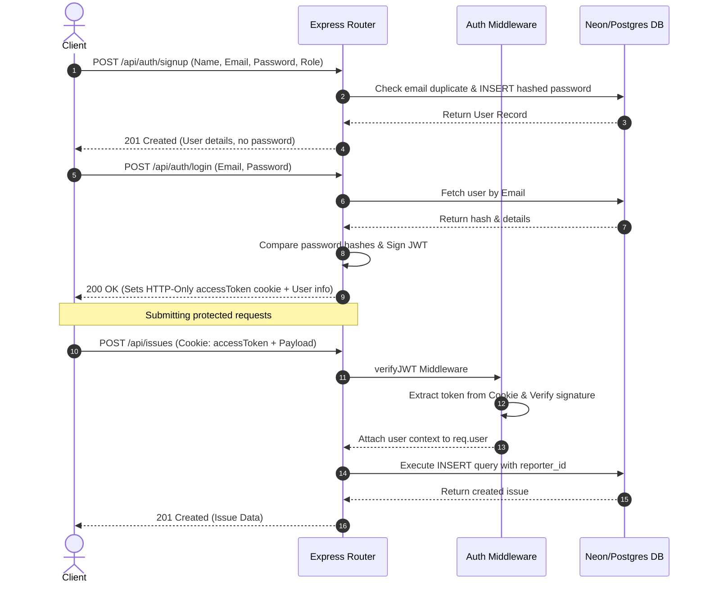
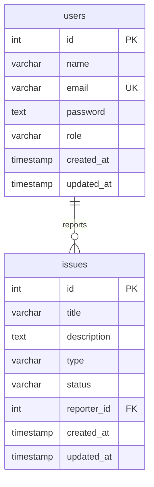

# 🚼 DevPulse API

Internal Tech Issue & Feature Tracker API for software teams to manage bugs, feature requests, and project workflows efficiently.

[](https://nodejs.org/)
[](https://www.typescriptlang.org/)
[](https://expressjs.com/)
[](https://www.postgresql.org/)
[](https://jwt.io/)
[](https://opensource.org/licenses/ISC)

---

## 🚀 Live Demo

🌐 [Live API Deployment URL](https://b7-a2-level-2.vercel.app/api/issues/) _(Update with your active deployment)_

---

## 🛠️ Technology Stack & Core Design

- **Runtime**: **Node.js (LTS v24+)** for non-blocking asynchronous execution.
- **Language**: **TypeScript** for static type-safety, clean compilation, and code readability.
- **Web Framework**: **Express.js (v5.2+)** utilizing a modular router and controller architecture.
- **Database Engine**: **PostgreSQL** for relational integrity.
- **SQL Execution**: **Raw SQL Queries** via the native `pg` driver (`Pool`). No query builders, ORMs, or manual SQL mapping wrappers are used.
- **Security & Cryptography**: **Bcrypt** (10 salt rounds) for password hashing and **JSON Web Tokens (JWT)** stored in **HTTP-Only cookies** for secure, stateless session management.

---

## 👥 Role-Based Access Control (RBAC) Matrix

DevPulse enforces strict RBAC at the controller and route layer:

| Action                         | Anonymous / Guest |          Contributor          |   Maintainer    |
| :----------------------------- | :---------------: | :---------------------------: | :-------------: |
| **Register & Login**           |        ✔️         |              ✔️               |       ✔️        |
| **View Issues (All / Single)** |        ✔️         |              ✔️               |       ✔️        |
| **Create Issue**               |        ❌         |              ✔️               |       ✔️        |
| **Update Own Issue**           |        ❌         | ✔️ (Only if status is `open`) | ✔️ (Any status) |
| **Update Others' Issues**      |        ❌         |              ❌               |       ✔️        |
| **Delete Any Issue**           |        ❌         |              ❌               |       ✔️        |

---

## 🔐 Authentication & Authorization Flow



---

## 🗄️ Database Schema & Index Design

The database schema is initialized dynamically upon server startup. The schema consists of two tables, triggers to automate record auditing, and optimized indexes.



### 1. `users` Table

Stores registered users with role constraints (`contributor`, `maintainer`).

| Column       | Data Type      | Constraints                                                 | Default             |
| :----------- | :------------- | :---------------------------------------------------------- | :------------------ |
| `id`         | `SERIAL`       | `PRIMARY KEY`                                               | _Auto-incrementing_ |
| `name`       | `VARCHAR(120)` | `NOT NULL`                                                  | -                   |
| `email`      | `VARCHAR(150)` | `UNIQUE`, `NOT NULL`                                        | -                   |
| `password`   | `TEXT`         | `NOT NULL`                                                  | -                   |
| `role`       | `VARCHAR(20)`  | `NOT NULL`, `CHECK (role IN ('contributor', 'maintainer'))` | `'contributor'`     |
| `created_at` | `TIMESTAMP`    | -                                                           | `NOW()`             |
| `updated_at` | `TIMESTAMP`    | -                                                           | `NOW()`             |

### 2. `issues` Table

Stores reported bugs and feature requests.

| Column        | Data Type      | Constraints                                              | Default             |
| :------------ | :------------- | :------------------------------------------------------- | :------------------ |
| `id`          | `SERIAL`       | `PRIMARY KEY`                                            | _Auto-incrementing_ |
| `title`       | `VARCHAR(150)` | `NOT NULL`                                               | -                   |
| `description` | `TEXT`         | `NOT NULL`, `CHECK (char_length(description) >= 20)`     | -                   |
| `type`        | `VARCHAR(30)`  | `NOT NULL`, `CHECK (type IN ('bug', 'feature_request'))` | -                   |
| `status`      | `VARCHAR(30)`  | `CHECK (status IN ('open', 'in_progress', 'resolved'))`  | `'open'`            |
| `reporter_id` | `INTEGER`      | `NOT NULL`                                               | -                   |
| `created_at`  | `TIMESTAMP`    | -                                                        | `NOW()`             |
| `updated_at`  | `TIMESTAMP`    | -                                                        | `NOW()`             |

### 3. Automatically Updated Timestamps (Triggers)

To ensure the accuracy of the `updated_at` field, a PL/pgSQL function and database triggers are defined on both tables:

```sql
CREATE OR REPLACE FUNCTION update_updated_at_column()
RETURNS TRIGGER AS $$
BEGIN
    NEW.updated_at = NOW();
    RETURN NEW;
END;
$$ language 'plpgsql';

CREATE TRIGGER trg_users_updated_at BEFORE UPDATE ON users FOR EACH ROW EXECUTE FUNCTION update_updated_at_column();
CREATE TRIGGER trg_issues_updated_at BEFORE UPDATE ON issues FOR EACH ROW EXECUTE FUNCTION update_updated_at_column();
```

### 4. Database Indexes

To maintain sub-millisecond query performance under scaling read operations, the following indexes are generated:

- `idx_users_email` (B-Tree on `users(email)`): For fast lookup during user login and validation.
- `idx_issues_reporter_id` (B-Tree on `issues(reporter_id)`): Speeds up lookups/filtering on issues reported by a specific user.
- `idx_issues_status` (B-Tree on `issues(status)`): Facilitates filtering issues by current workflow state.
- `idx_issues_type` (B-Tree on `issues(type)`): Optimizes filtering issues by category.
- `idx_issues_created_at` (B-Tree Descending on `issues(created_at DESC)`): Speeds up sorting operations which default to `newest`.

---

## 🔗 API Documentation & Usage Contract

All API responses follow a strict schema signature. Success responses utilize `ApiResponse` structures, and exceptions are gracefully bubbled via `ApiError`.

### 🔹 Authentication Module

#### 1. Register Account

- **Endpoint**: `POST /api/auth/signup`
- **Access**: Public
- **Request Body**:
  ```json
  {
    "name": "Jane Doe",
    "email": "jane.doe@devpulse.com",
    "password": "supersecretpassword123",
    "role": "contributor"
  }
  ```
- **Success Response (201 Created)**:
  ```json
  {
    "statusCode": 201,
    "success": true,
    "message": "User registered successfully",
    "data": {
      "id": 2,
      "name": "Jane Doe",
      "email": "jane.doe@devpulse.com",
      "role": "contributor",
      "created_at": "2026-05-28T07:50:00.000Z",
      "updated_at": "2026-05-28T07:50:00.000Z"
    }
  }
  ```

#### 2. Authenticate / Login

- **Endpoint**: `POST /api/auth/login`
- **Access**: Public
- **Request Body**:
  ```json
  {
    "email": "jane.doe@devpulse.com",
    "password": "supersecretpassword123"
  }
  ```
- **Cookies Set**:
  - `accessToken`: Secure, HTTP-Only Cookie containing JWT token (Expires in 7 days).
- **Success Response (200 OK)**:
  ```json
  {
    "statusCode": 200,
    "success": true,
    "message": "Login successful",
    "data": {
      "user": {
        "id": 2,
        "name": "Jane Doe",
        "email": "jane.doe@devpulse.com",
        "role": "contributor",
        "created_at": "2026-05-28T07:50:00.000Z",
        "updated_at": "2026-05-28T07:50:00.000Z"
      }
    }
  }
  ```

---

### 🔹 Issues Module

#### 3. Create Issue

- **Endpoint**: `POST /api/issues`
- **Access**: Authenticated (`contributor` or `maintainer`)
- **Cookies**: Requires `accessToken` cookie.
- **Request Body**:
  ```json
  {
    "title": "Application crashes during login",
    "description": "Clicking the login button with empty fields causes a complete app crash instead of error validation.",
    "type": "bug"
  }
  ```
- **Success Response (201 Created)**:
  ```json
  {
    "statusCode": 201,
    "success": true,
    "message": "Issue created successfully",
    "data": {
      "id": 1,
      "title": "Application crashes during login",
      "description": "Clicking the login button with empty fields causes a complete app crash instead of error validation.",
      "type": "bug",
      "status": "open",
      "reporter_id": 2,
      "created_at": "2026-05-28T08:00:00.000Z",
      "updated_at": "2026-05-28T08:00:00.000Z"
    }
  }
  ```

#### 4. Get All Issues

- **Endpoint**: `GET /api/issues`
- **Access**: Public
- **Query Parameters**:
  - `sort`: `newest` (default) or `oldest`
  - `type`: `bug` or `feature_request` (optional)
  - `status`: `open`, `in_progress`, or `resolved` (optional)
- **Success Response (200 OK)**:
  ```json
  {
    "statusCode": 200,
    "success": true,
    "message": "Issues retrieved successfully",
    "data": [
      {
        "id": 1,
        "title": "Application crashes during login",
        "description": "Clicking the login button with empty fields causes a complete app crash instead of error validation.",
        "type": "bug",
        "status": "open",
        "reporter": {
          "id": 2,
          "name": "Jane Doe",
          "role": "contributor"
        },
        "created_at": "2026-05-28T08:00:00.000Z",
        "updated_at": "2026-05-28T08:00:00.000Z"
      }
    ]
  }
  ```

#### 5. Get Single Issue Details

- **Endpoint**: `GET /api/issues/:id`
- **Access**: Public
- **Success Response (200 OK)**:
  ```json
  {
    "statusCode": 200,
    "success": true,
    "message": "Issue retrieved successfully",
    "data": {
      "id": 1,
      "title": "Application crashes during login",
      "description": "Clicking the login button with empty fields causes a complete app crash instead of error validation.",
      "type": "bug",
      "status": "open",
      "reporter": {
        "id": 2,
        "name": "Jane Doe",
        "role": "contributor"
      },
      "created_at": "2026-05-28T08:00:00.000Z",
      "updated_at": "2026-05-28T08:00:00.000Z"
    }
  }
  ```

#### 6. Update Issue Fields

- **Endpoint**: `PATCH /api/issues/:id`
- **Access**: Authenticated (`maintainer` can update any field/status. `contributor` can update their own issue _only_ if the status is `'open'`).
- **Cookies**: Requires `accessToken` cookie.
- **Request Body** (All fields optional):
  ```json
  {
    "title": "Updated: Application crashes during login",
    "description": "This is an updated issue description clarifying reproducing steps.",
    "status": "in_progress"
  }
  ```
- **Success Response (200 OK)**:
  ```json
  {
    "statusCode": 200,
    "success": true,
    "message": "Issue updated successfully",
    "data": {
      "id": 1,
      "title": "Updated: Application crashes during login",
      "description": "This is an updated issue description clarifying reproducing steps.",
      "type": "bug",
      "status": "in_progress",
      "reporter_id": 2,
      "created_at": "2026-05-28T08:00:00.000Z",
      "updated_at": "2026-05-28T08:15:00.000Z"
    }
  }
  ```

#### 7. Delete Issue

- **Endpoint**: `DELETE /api/issues/:id`
- **Access**: Authenticated (`maintainer` only)
- **Cookies**: Requires `accessToken` cookie.
- **Success Response (200 OK)**:
  ```json
  {
    "statusCode": 200,
    "success": true,
    "message": "Issue deleted successfully",
    "data": {}
  }
  ```

---

## 📁 Project Architecture & Directory Layout

The codebase follows modular, clean-architecture principles:

```
B7A2_LEVEL2/
├── src/
│   ├── config/              # Central configuration modules
│   │   ├── db.ts            # PG pool configuration & export
│   │   ├── env.ts           # Environment variables check & defaults
│   │   └── status.ts        # HTTP Status constant mappings
│   ├── controllers/         # Business logic layer
│   │   ├── issue.controller.ts # Issues CRUD operations with permissions
│   │   └── user.controller.ts  # Auth (signup, login) control flow
│   ├── middlewares/         # Application request filters
│   │   ├── auth.middleware.ts  # JWT checks (cookies extraction) and Role RBAC authorization
│   │   └── middlewares.ts   # Core configurations (cors, cookieParser, express json parsing)
│   ├── models/              # Schema builders (invokes SQL templates)
│   │   ├── indexes.model.ts
│   │   ├── issues.model.ts
│   │   └── user.model.ts
│   ├── routes/              # Express route trees
│   │   ├── issues/
│   │   │   └── issues.routes.ts
│   │   └── user.routes.ts
│   ├── sql/                 # Raw SQL DDL/DML definition templates
│   │   ├── indexes.sql      # Database indexing queries
│   │   ├── issues.sql       # Issues table DDL with check triggers
│   │   └── users.sql        # Users table DDL with check triggers
│   ├── types/               # Type definition files
│   │   └── customRequest.type.ts
│   ├── utils/               # Shared helpers & common components
│   │   ├── ApiError.ts      # Custom error response formatting class
│   │   ├── ApiResponse.ts   # Custom success response formatting class
│   │   └── AsyncHandler.ts  # Express middleware promise-wrapper
│   ├── app.ts               # Application declaration & middleware registers
│   ├── db.model.ts          # Main model initialization execution block
│   └── server.ts            # Application server initialization & entry point
├── .env.example             # Template for secure environment settings
├── tsconfig.json            # Static compiler config rules
└── package.json             # Scripts & node dependencies definition
```

---

## ⚙️ Environment Variables Settings

Create a `.env` file in the root directory by copying the `.env.example` file and filling out the parameters:

```env
PORT=3000
CORS_ORIGIN="*"

# PostgreSQL DB connection string (Supabase, NeonDB, or local instance)
DATABASE_URL="postgresql://<user>:<password>@<host>:<port>/<db>?sslmode=require"

# Authentication Security Secrets
ACCESS_TOKEN_SECRET="generate_a_secure_token_secret_key"
ACCESS_TOKEN_EXPIRE_MINUTES=15
REFRESH_TOKEN_SECRET="generate_a_secure_refresh_secret_key"
REFRESH_TOKEN_EXPIRE_DAYS=7
```

---

## 🔧 Installation & Execution Instructions

Follow these steps to deploy a local instance of the DevPulse API server:

### 1. Prerequisites

- **Node.js**: `v24` or higher installed. Check with: `node -v`
- **PostgreSQL**: Access to a clean database schema (local or cloud-hosted).

### 2. Setup Database

1. Copy the `.env.example` file to `.env`:
   ```bash
   cp .env.example .env
   ```
2. Provide your valid connection strings. The tables, triggers, and indices will automatically generate dynamically on database connection startup (via `modelInitiation()`).

### 3. Installation

Install the project dependencies locally:

```bash
npm install
```

### 4. Development Run

Start the development server with live reload powered by `tsx watch`:

```bash
npm run dev
```

### 5. Production Compilation

Compile TypeScript to JavaScript target output (`/dist`):

```bash
npm run build
```

Run compiled production code:

```bash
npm start
```

---

## 🧪 Testing and API Validation

Use **Postman**, **Insomnia**, or **cURL** to send requests to local server routes.
For authenticated routes, ensure that the client supports cookie handling or manually attach the cookie header:

```http
Cookie: accessToken=<your_received_jwt_token_on_login>
Content-Type: application/json
```

Check status codes against standard HTTP specifications defined in the application configuration:

- `200` OK: Success responses on fetches, updates, and deletes.
- `201` Created: Resource successfully provisioned (signup/issue registration).
- `400` Bad Request: Malformed inputs, missing parameters.
- `401` Unauthorized: Expired/missing/broken JWT cookie context.
- `403` Forbidden: Disallowed roles attempting operations.
- `404` Not Found: Database record does not exist.
- `409` Conflict: Resource already exists.

---

_Built with care as part of B7A2 Level 2 Assignment._
